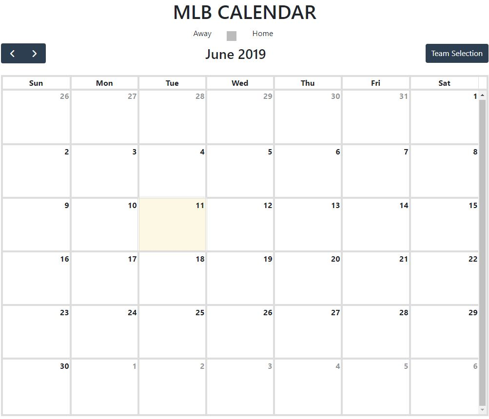
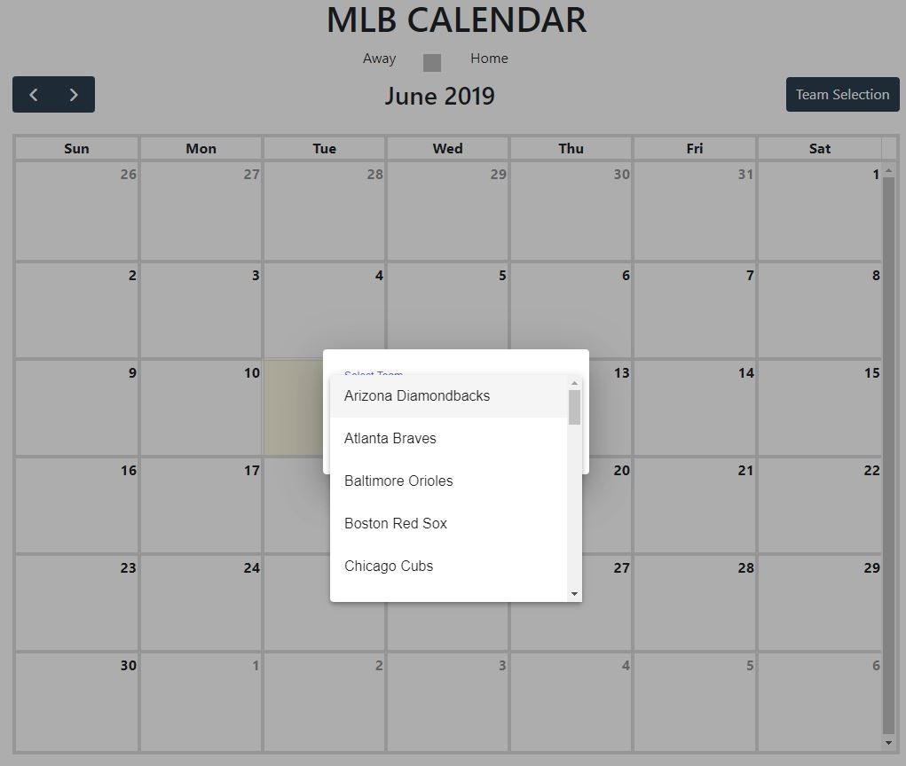
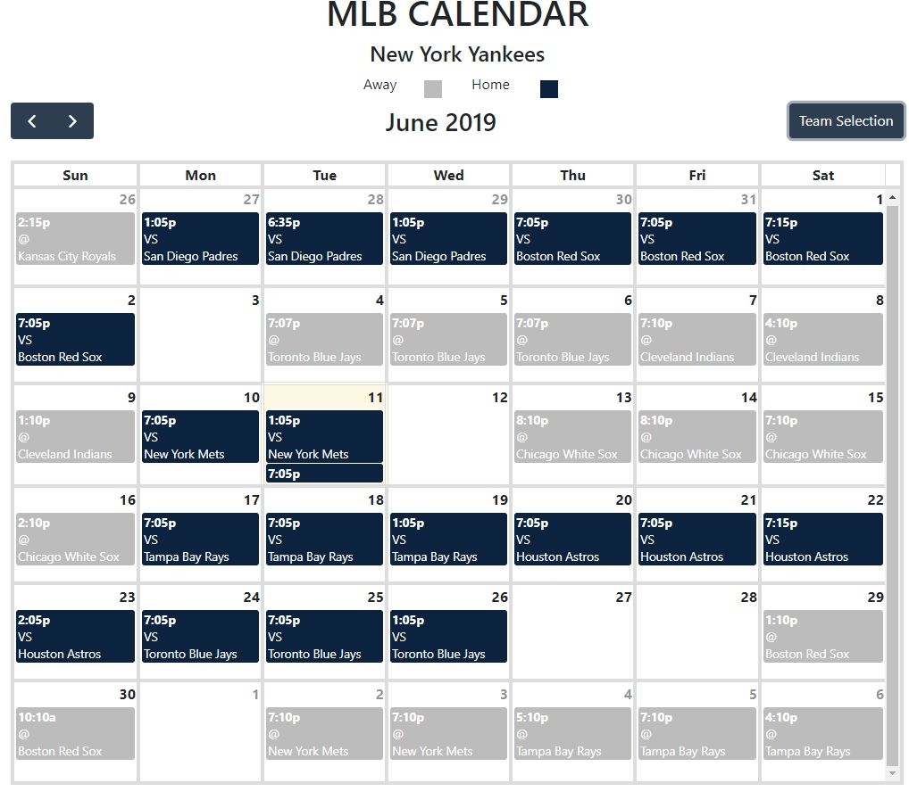

# MLB_Calendar_ver2
Web app that shows the monthly MLB schedule. The schedule is pulled from StatsApi.MLB.com. This version uses Spring Boot, Angular 7 and PrimeNG FullCalendar.

## Changes from previous version
* Now shows doubleheaders

## Future Plans
* Show win/loss for past games.
* Indicate suspended games.

## Built With
* Spring Boot
* Angular 7
* [PrimeNG FullCalendar](https://www.primefaces.org/primeng/#/fullcalendar)
* Maven
* Gson
